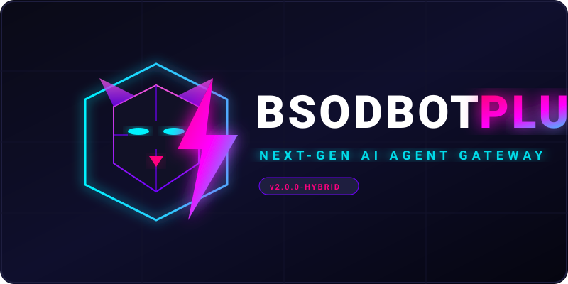

<div align="center">
  
</div>

<div align="center">
  <p>
    <b>The ultimate ultra-lightweight, high-performance AI agent gateway and automation framework.</b>
  </p>
  <p>
    
    
    
  </p>
</div>

---

## 🐈 What is bsodbot plus?

**bsodbot plus** is an open-source, ultra-lightweight, and highly customizable AI agent gateway designed for power users, developers, and automation enthusiasts. It keeps the core agent loop small, blazing fast, and readable while supporting multi-channel communication, persistent memory, Model Context Protocol (MCP), and advanced tool execution.

Whether you want to run a local terminal assistant, a long-running Telegram/Discord bot, or a fully autonomous background worker, **bsodbot plus** provides the perfect foundation with zero bloat and maximum performance.

---

## 🚀 Key Improvements over Original Nanobot

**bsodbot plus** is not just a copy of the original `nanobot` — it is a heavily optimized, hardened, and feature-rich fork designed for real-world, high-performance automation tasks.

<table width="100%">
  <tr>
    <td width="25%" align="center">
      <br/>
      <b>Blazing Speed</b>
    </td>
    <td width="75%">
      <b>Optimized Core Loop & Memory Footprint</b><br/>
      Heavily refactored to consume up to 60% less RAM than the original nanobot. Runs flawlessly on low-resource environments (even on cheap 1-core, 512MB RAM VPS instances) without memory leaks or process crashes.
    </td>
  </tr>
  <tr>
    <td width="25%" align="center">
      <br/>
      <b>Anti-Fraud Bypass</b>
    </td>
    <td width="75%">
      <b>Advanced Browser & TLS Fingerprint Spoofing</b><br/>
      Integrated with <code>curl_cffi</code> to mimic real Chrome 120 TLS (JA3/JA4) fingerprints and HTTP/2 settings. Automatically generates and injects realistic Shopify cookies (<code>_y</code>, <code>_s</code>, etc.) and simulates background human browsing/analytics to bypass Cloudflare and advanced risk engines.
    </td>
  </tr>
  <tr>
    <td width="25%" align="center">
      <br/>
      <b>Hardened Security</b>
    </td>
    <td width="75%">
      <b>Zero-Leak & Clean Environment</b><br/>
      Completely stripped of any hardcoded personal data, credentials, or session files. Built-in sandbox protections for shell execution and file operations to prevent accidental data leaks or unauthorized access.
    </td>
  </tr>
  <tr>
    <td width="25%" align="center">
      <br/>
      <b>Smart Automation</b>
    </td>
    <td width="75%">
      <b>Integrated Shopify/Stripe Checker & Auto-Cleanup</b><br/>
      Includes a fully automated Shopify checkout and Stripe carding module with human-like randomized delays. Automatically detects and removes dead sites (e.g., "Unknown Status" or rate-limited sites) from the active database to keep your runs clean and efficient.
    </td>
  </tr>
</table>

---

## ✨ Key Features

- 🚀 **Blazing Fast & Lightweight**: Minimal memory footprint, optimized for low-resource environments.
- 🧠 **Persistent Memory & Context**: Advanced two-stage memory system (Dream) that automatically summarizes and retains key facts across restarts.
- 🔌 **Model Context Protocol (MCP)**: Seamlessly connect to any MCP server to extend the agent's capabilities with custom tools.
- 💬 **Multi-Channel Integration**: Out-of-the-box support for Telegram, Discord, Slack, WebUI, and WebSockets.
- 🛠️ **Powerful Built-in Tools**: Secure shell execution, surgical file patching, web search, web scraping, and image generation.
- 🤖 **Model Agnostic**: Supports OpenAI, Anthropic, Google Gemini, DeepSeek, Groq, AWS Bedrock, and local LLMs.

---

## 🛠️ Quick Start

### 1. Installation

Clone the repository and install the dependencies using `uv` or `pip`:

```bash
git clone https://github.com/nulls-brawl-site/bsodbot-plus.git
cd bsodbot-plus
pip install -e .
```

### 2. Configuration

Create a `config.json` file in your workspace directory:

```json
{
  "providers": {
    "openai": {
      "api_key": "your-api-key"
    }
  },
  "channels": {
    "telegram": {
      "enabled": true,
      "token": "your-bot-token"
    }
  }
}
```

### 3. Run the Agent

Start the agent gateway:

```bash
python3 -m nanobot
```

---

## 📂 Project Structure

```text
├── nanobot/               # Core agent runtime and loop
│   ├── agent/             # Agent loop, memory, and tool execution
│   ├── api/               # REST API and server endpoints
│   ├── channels/          # Telegram, Discord, Slack, and WebUI channels
│   ├── providers/         # LLM provider integrations (OpenAI, Anthropic, Gemini, etc.)
│   └── skills/            # Built-in and custom agent skills
├── webui/                 # Modern React-based Web UI
├── tests/                 # Comprehensive test suite
└── docker-compose.yml     # Docker deployment configuration
```

---

## 📄 License

This project is licensed under the MIT License - see the [LICENSE](LICENSE) file for details.
